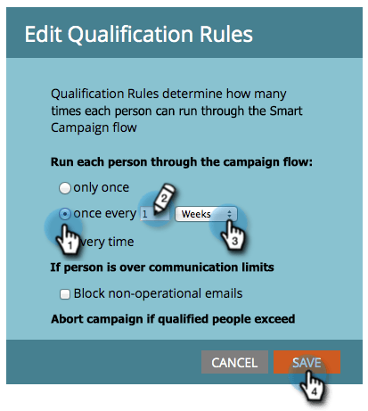

# Een slimme campagne activeren in Marketo Engage met de REST API en tokens

In deze zelfstudie wordt uitgelegd hoe u een slimme campagne in Marketo Engage kunt activeren met behulp van de REST API en de e-mail kunt aanpassen met Mijn tokens. Dit gebruiksgeval is ideaal voor door de klant geïnitieerde meldingen zoals webinar-herinneringen, instapstappen of follow-ups na aankoop.

## Hoofdletters gebruiken {#use-case}

Een persoon registreert zich voor een webinar door een extern platform (b.v., douane app, Pendo, Eventbrite). U wilt automatisch:

* Een herinneringsbericht vanuit Marketo Engage activeren
* Deze aanpassen met:
   * De voornaam van de persoon
   * Webinar-titel
   * Een unieke koppeling maken

Dit kan worden gedaan gebruikend REST API en Mijn Tokens.

## Stap 1: De slimme campagne maken {#step-one}

1. Ga naar **de Activiteiten van de Marketing**, en onder uw [ omslag van Programma&#39;s ](https://experienceleague.adobe.com/en/docs/marketo/using/product-docs/core-marketo-concepts/programs/creating-programs/understanding-programs){target="_blank"}, creeer een nieuwe [ Slimme Campagne ](https://experienceleague.adobe.com/en/docs/marketo/using/product-docs/core-marketo-concepts/smart-campaigns/understanding-smart-campaigns){target="_blank"} geroepen `Send Webinar Reminder`.

1. In de **Slimme Lijst** tabel, [ voeg een trekker ](https://experienceleague.adobe.com/en/docs/marketo/using/product-docs/core-marketo-concepts/smart-campaigns/creating-a-smart-campaign/define-smart-list-for-smart-campaign-trigger){target="_blank"} toe om de campagne toe te staan om via API worden geroepen:

   * Selecteer **Campagne wordt gevraagd** als trekker
   * Plaats **Source** aan `Web Service API`


## Stap 2: De e-mailinhoud definiëren {#step-two}

Creeer of geef een [ e-mailactiva ](https://experienceleague.adobe.com/en/docs/marketo-developer/marketo/rest/assets/emails){target="_blank"} uit die verwijzingen zowel Persoon als [ Mijn Tokens ](https://experienceleague.adobe.com/en/docs/marketo/using/product-docs/core-marketo-concepts/programs/tokens/managing-my-tokens){target="_blank"}.

>[!NOTE]
>
>Zorg ervoor dat u de tokens rechtstreeks in de e-mailinhoud invoegt, zoals hieronder wordt weergegeven.

```html
Hi {{lead.First Name:default=Customer}}

You're registered for **{{my.WebinarTitle}}**.

Join here: {{my.JoinLink}}
```

Als u een token gebruikt om een afbeeldings-URL dynamisch te injecteren (bijvoorbeeld `{{my.WebinarImage}}`), moet u het token opnemen in een HTML-afbeeldingstag:

```html

```

>[!IMPORTANT]
>
>Marketo Enagage **zal niet** het beeld teruggeven tenzij het teken binnen een geldige beeldmarkering wordt geplaatst.


## Stap 3: Tokens toevoegen aan het programma {#step-three}

Als u waarden dynamisch wilt doorgeven via API, moeten de tokens al bestaan in Marketo Engage. U zult hen onder **moeten creëren Mijn Tokens** lusje van uw Programma.

1. Ga naar **Mijn Tokens** lusje van uw ouderProgramma.

2. De belemmering in het teken van de a **Tekst** van het rechterpaneel voor elke dynamische waarde.

* `{{my.WebinarTitle}}` - Teksttoken
* `{{my.JoinLink}}` - Teksttoken
* `{{my.WebinarImage}}` - Teksttoken (dit wordt gebruikt als de `src` in een `` -tag)


## Stap 4: Stel kwalificatieregels voor de campagne in en activeer de campagne {#step-four}

1. Vorm de [ kwalificatieregels ](https://experienceleague.adobe.com/en/docs/marketo/using/product-docs/core-marketo-concepts/smart-campaigns/using-smart-campaigns/edit-qualification-rules-in-a-smart-campaign){target="_blank"} om te controleren hoe vaak een persoon door de Slimme Campagne kan lopen.

1. Zodra gevormd, activeer **** om de Slimme Campagne toe te laten om API-teweeggebrachte verzoeken te ontvangen.



## Stap 5: Trigger de campagne via REST API {#step-five}

### Campagne-id zoeken {#find-the-campaign-id}

Om een Slimme Campagne via API teweeg te brengen, zult u **campagne identiteitskaart** nodig hebben:

1. Zoek en selecteer de slimme campagne die u wilt activeren.

1. Bekijk de URL in uw browser. Het zal iets als dit kijken: `https://app-XXX.marketo.com/#/classic/SC`**1234**`A1ZN38`.

1. De 4 cijfers na `SC` is uw campagne-id. In het bovenstaande voorbeeld is de slimme campagne-id &#39;1234&#39;

Gebruik het volgende eindpunt:

```
POST /rest/v1/campaigns/{campaignId}/trigger.json
```

Voorbeeld:

```
POST /rest/v1/campaigns/1234/trigger.json
```

### Voorbeeld verzoektekst {#example-request-body}

```json
{
  "input": {
    "leads": [
      {
        "id": 1002200
      }
    ],
    "tokens": [
      {
        "name": "{{my.WebinarTitle}}",
        "value": "Scaling Customer Engagement in 2025"
      },
      {
        "name": "{{my.JoinLink}}",
        "value": "https://webinars.company.com/join/abc123"
      },
      {
        "name": "{{my.WebinarImage}}",
        "value": "https://experienceleague.adobe.com/en/docs/marketo-learn/tutorials/events/media_1c6f338a518ada11550084c8ab3a6bbf554ff6eac.jpeg"
      }
    ]
  }
}
```

>[!IMPORTANT]
>
>Vervang `1002200` in het bovenstaande hoofdvoorbeeld door de juiste persoon-id uit uw Marketo Engage-exemplaar.

## Toestemming {#authorization}

Voor alle Marketo REST API-aanvragen is een OAuth 2.0-toegangstoken vereist.

Om uw toegangstoken terug te winnen, gebruik het volgende eindpunt:

```
GET /identity/oauth/token?grant_type=client_credentials&client_id=XXX&client_secret=YYY
```

Zodra u uw toegangstoken ontvangt, omvat het als a _vraagparameter_ in alle API verzoeken:

```
Authorization: Bearer YOUR_ACCESS_TOKEN
```

## Aanbevolen procedures {#best-practices}

* Fallback-/standaardwaarden toevoegen aan uw tokens voor tests en QA
* `{{lead.token}}` gebruiken voor persoonvelden en `{{my.token}}` voor dynamische waarden met een bereik van een campagne
* Marketo Engage biedt ondersteuning voor maximaal 100 personen per aanvraag
* Personen moeten voldoen aan de criteria van de slimme lijst, anders worden ze stilletjes overgeslagen

## Samenvatting {#summary}

Met deze benadering, kunt u mededelingen personaliseren gebruikend Slimme Campagnes die van externe platforms via API worden teweeggebracht. Dit is handig voor scenario&#39;s zoals bevestigingen van webinar-registratie, e-mails aan boord gaan en transactionele meldingen. Dit is allemaal handig voor het injecteren van real-time gegevens met My Tokens.
