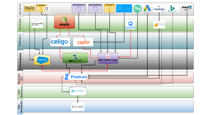

# Creeer een visueel gegevensstroomdiagram om uw marketing technologiestapel te begrijpen

Als beheerder die een [!DNL Marketo Engage] het is een missie die al jarenlang actief is en die onmogelijk kan worden gecontroleerd en opgehelderd . Wanneer Adobe [!DNL Marketo Champion] (2019), Kelly Jo Horton, die al lang in een instantie zit, heeft deze uitdaging aangepakt door [het creëren van een diagram van &quot;Lood en gegevensbronnen&quot;](https://nation.marketo.com/t5/employee-blogs/understand-your-marketing-technology-and-data-create-this/ba-p/296774){target="_blank"} om zich vertrouwd te maken met het gegevensuniversum. In deze zelfstudie leert u hoe u uw eigen gegevensstroomdiagram kunt maken door voort te bouwen op de voorbeelden die Kelly Jo Horton deelt. Laten we je MarTech-ecosysteem leren kennen!

## Waarom creeer een architectuurdiagram voor uw geërfte instantie?

1. **Maak uzelf bekend met de technologiestapel voor marketing die u van een liveinstantie hebt overgenomen.** Alle managers van de Verrichting van de Marketing/van de Verrichtingen van het Platform worden aangemoedigd om dit oefening te doen wanneer het beginnen bij een nieuw bedrijf. Met dit ontwerpproces kunnen beheerders een volledig beeld zien van de gegevens en activiteiten die van externe integratie naar [!DNL Marketo Engage] en om de API-fouten gemakkelijk op te lossen.
2. **Verken uzelf met de belangrijkste belanghebbenden die de externe integratie beheren.** Een tip die Kelly Jo Horton gebruikt om snel de belanghebbenden te identificeren, is door naar de lijst met API-gebruikers te verwijzen.
   1. **Navigeer naar het tabblad &#39;Integration>LaunchPoint&#39; in de sectie &#39;Admin&#39;.** Meer informatie over het navigeren naar het tabblad LaunchPoint: [Een aangepaste service maken voor gebruik met REST API](https://experienceleague.adobe.com/docs/marketo/using/product-docs/administration/additional-integrations/create-a-custom-service-for-use-with-rest-api.html){target="_blank"}.
   2. Vind API gebruiksstatistieken door API gebruiker in het lusje van de Diensten van de Integratie>van het Web in de sectie van de Informatie van de Vraag van API. Door op het API vraagaantal te klikken, kunt u de specifieke individuele vraag bekijken die door elke gebruiker wordt gemaakt.

## Hoe te om deze visuele oefening van het gegevensstroomdiagram te doen

### Stap 1: Diagram huidige staat

Maak een diagram met de status Huidig. Hier volgt een voorbeeld:

{align="center"}

### Stap 2: Toekomstig overzicht

Een &quot;Toekomstige staat&quot;-diagram maken dat kan worden gebruikt bij de presentatie van de routekaart voor technologie en systemen aan niet-technische belanghebbenden. Hier volgt een voorbeeld:

{align="center"}

### Stap 3: Technische versie

Maak een technische versie met details zoals de API-gebruikersnaam voor elke integratie, een korte beschrijving van het type gegevens waarnaar wordt verwezen [!DNL Marketo Engage] of uit [!DNL Marketo Engage]en een gedetailleerd diagram van de stromen en triggers van middleware.  Hier volgt een voorbeeld:

{align="center"}

## Wat is de volgende?

**Aan de slag met voorbeelden:**
Download één van de diagrammen van de steekproefgegevensstroom om de huidige staat van uw marketing technologiestapel, persoon en gegevensstroom in kaart te brengen, of een diagram voor uw gegevensuniversum van kras te creëren aangezien u de instantie controleert:

<table style="table-layout:fixed">
   <tr>  
      <td style="border: 0;">
      

          <a href="./_assets/downloads/Current_Future_State_Lead_Data_Sources.zip">
            <strong>Huidige staat en Toekomstige staat</strong>
         </a>
      

      </td>
      <td style="border: 0;">
      

         <a href="./_assets/downloads/Detailed_Layers_by_Functional_Category_Stacked_Technologies.zip">
         <strong>Gedetailleerde lagen per functionele categorie </strong>   
         </a>
      

      </td>
      <td style="border: 0;">
         

         <a href="./_assets/downloads/Lead_Data_Source.zip">
           <strong>Stroom van lood en gegevensbron </strong>  
         </a>
         

       </td> 
       <td style="border: 0;">
         

         <a href="./_assets/downloads/Simple_World_Class_Stage_Stack.zip">
          <strong>Vereenvoudigd diagram</strong>  
         </a>
         

        </td>  
   </tr>
   <tr>
    <td style="border: 0;">
         

          
         </a>
      

      </td>
      <td style="border: 0;">
         

         
         

      </td>
       <td style="border: 0;">
         

            
         

      </td>
     <td style="border: 0;">
         

            
         

      </td>
</table>

Dit zijn enkele gereedschappen die u kunt gebruiken: draw.io (Google Docs), Adobe XD, Figma, Gliffy (in Confluence)

**Wat gebeurt er als er al architectuurdiagrammen zijn?** Nieuwe teamleden kunnen verschillende perspectieven hebben. Er is waarde aan nieuwe [!DNL Marketo Engage] de beheerders doen dit als onderdeel van hun instapproces en delen het met anderen .

## Auteurs

**Kelly Jo Horton**\
Adobe Marketo Champion (2019)
*Senior Client Partner in Etumos*

{width="30%"}

**Amy Chiu**
*Beheer van toepassings- en retentie-marketing, Adobe*

{width=30%}
